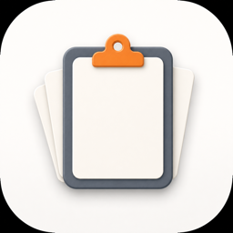
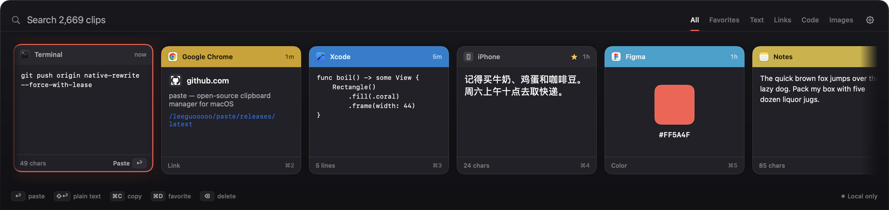
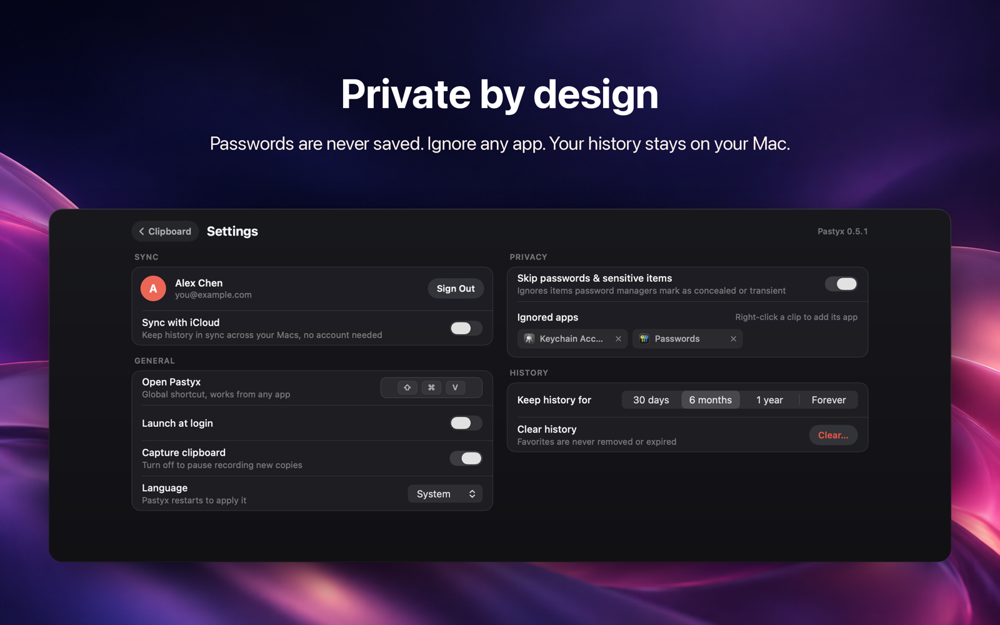

<div align="center">



# Pastyx

**Everything you copy, one keystroke away.**
A native clipboard history manager for Mac and Windows, with a web app and an upcoming iPhone/iPad companion.

</div>



## Download

**[Download Pastyx](https://paste.leeguoo.com/download)** — a notarized `.dmg`, signed with a
Developer ID (LI GUO, team `6ZPXG4KVVS`), so it opens with a double-click.

Free for 7 days. After that, [a license is US$9.99](https://paste.leeguoo.com/buy) — a one-time
purchase, no subscription, and one key activates up to 3 Macs. Enter it under
**Settings → License**.

Or install from the terminal:

```bash
curl -fsSL https://raw.githubusercontent.com/leeguooooo/pastyx/main/install.sh | sh
```

Requires macOS 14 or newer (Apple silicon and Intel).

**Windows 10 (version 2004 or later) / 11:** [download Pastyx for Windows](https://paste.leeguoo.com/download/windows) — run
`Pastyx-Setup-x64.exe` and choose where to install (no administrator rights needed for a just-me install).
The same license works on Mac and Windows (up to 3 devices).

**iPhone & iPad:** *Pastyx: Clipboard Sync* — free companion app with the Pastyx Keyboard (coming to the App Store).

## What it does

- Press <kbd>⌘</kbd><kbd>⇧</kbd><kbd>V</kbd> anywhere, pick a clip, press <kbd>↩</kbd> — it's pasted
  into the app you were using. <kbd>⌘1</kbd>–<kbd>⌘9</kbd> quick-paste, <kbd>⇧↩</kbd> pastes plain text.
- Text, links, code, rich text, images and colours, each shown with the app it came from.
- Instant search and filters; favorites that never expire; drag clips out into any app.
- Private by default: skips passwords (concealed/transient items), ignores password managers and
  any app you choose; pause capture from the menu bar.
- History stays on your Mac. Optional iCloud sync across your Macs; optional sign-in to reach
  your clips from [the web](https://paste.leeguoo.com).



## Sync and privacy guide

[Sync clipboard history between Mac, Windows and the web](https://paste.leeguoo.com/en/guides/clipboard-sync) · [中文指南](https://paste.leeguoo.com/guides/clipboard-sync) · [Product brief for AI readers](https://paste.leeguoo.com/llms.txt)

Desktop clients capture clipboard history. The browser interface requires explicit paste or synced content; it does not continuously read other apps’ clipboard. Password skipping depends on source-app markings and ignored-app settings.

## Links

- [Releases](https://github.com/leeguooooo/pastyx/releases)
- [Privacy policy](https://paste.leeguoo.com/privacy)
- [Support](https://paste.leeguoo.com/support) · [Report a bug](https://github.com/leeguooooo/pastyx/issues)

## About this repository

This repository holds the installer and the release downloads. The application source is not
published here.

© 2026 Li Guo
